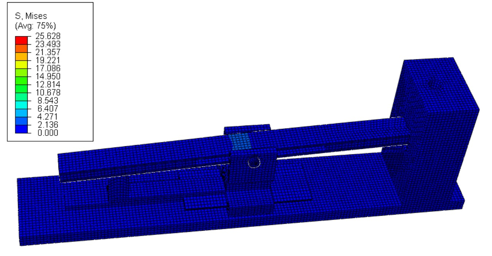
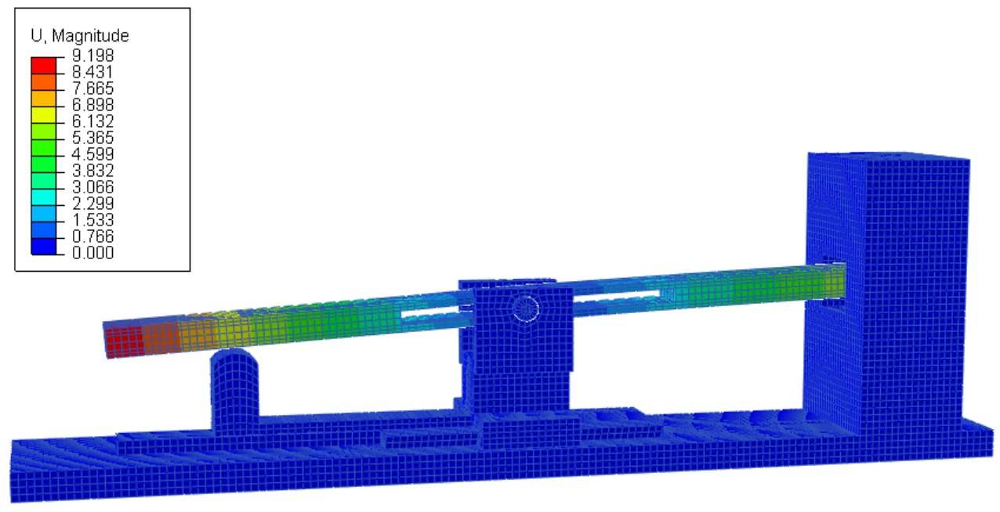
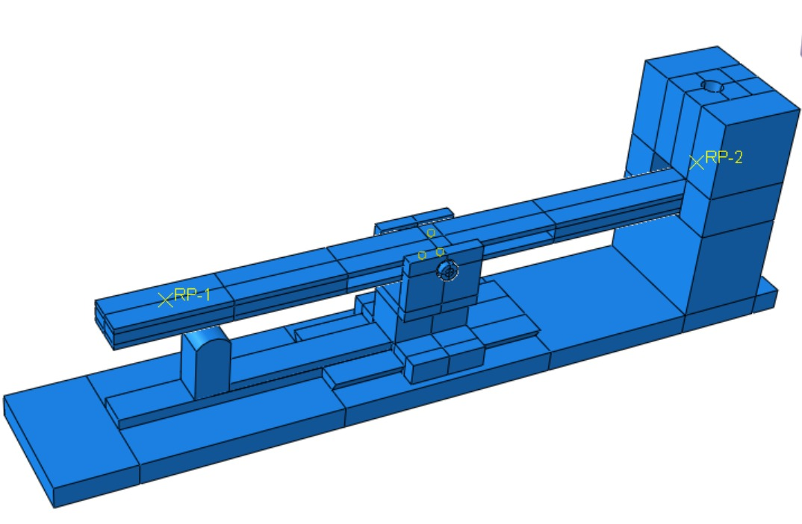
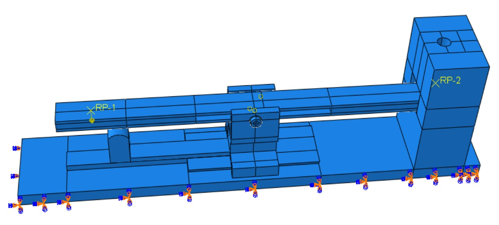
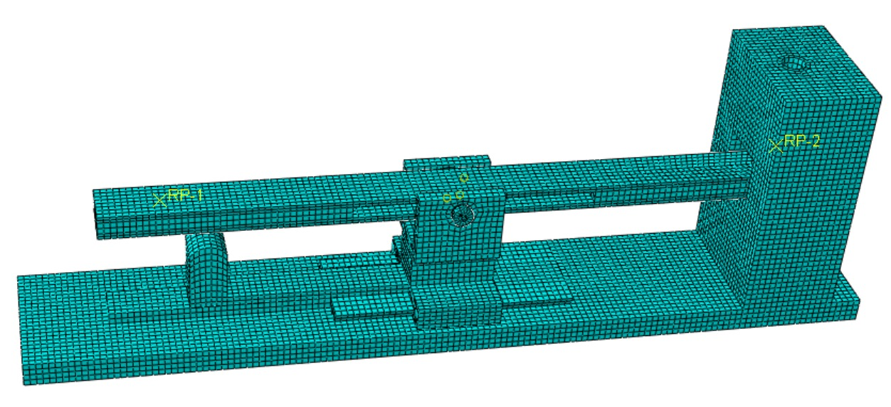

# abaqus-hand-rehabilitation-device
Finite element analysis of a hand rehabilitation device using Abaqus under a representative 4 N load.
# Hand Rehabilitation Device — FEA Study

## Overview

This project is part of my Bachelor's thesis, *Design of a Device for the Rehabilitation of Patients with Hand Conditions*. The work involved the design and numerical evaluation of a mechanical device intended to assist hand rehabilitation exercises.

The mechanism operates as a first-class lever: a force applied to the movable lever is transferred through the pivot and support structure. A simplified finite element model was developed in Abaqus/CAE to evaluate the structural response of the mechanism under a representative 4 N load.

## Objective

The FEA was used to:

* identify critical stress concentrations within the mechanism;
* evaluate the maximum von Mises stress;
* assess the displacement of the movable lever;
* check the structural stiffness of the simplified geometry;
* assess the structural response of the optimized design under the investigated loading condition.

## My Contribution

I developed the simplified FEA model directly in Abaqus/CAE, including:

* geometry simplification and partitioning;
* material and section definition;
* assembly setup;
* contact and constraint definition;
* boundary conditions and loading;
* mesh generation;
* analysis setup;
* post-processing and interpretation of the results.

## Software and Tools

* Abaqus/CAE
* PTC Creo Parametric

## Model Simplification

The original CAD geometry was simplified in Abaqus before the analysis to reduce unnecessary geometric complexity and improve computational efficiency.

Fillets were removed from the simplified components, while manufacturing clearances present in the original CAD model were excluded from the numerical analysis. Adjustment and pretensioning screws were also omitted from the FEA model.

The helical spring was not modeled as a solid geometry. Its mechanical effect was represented using a kinematic coupling.

## Material

The components were modeled using PETG with an isotropic linear elastic material model.

| Property        |    Value |
| --------------- | -------: |
| Young's modulus | 2200 MPa |
| Poisson's ratio |     0.40 |

A homogeneous solid section was assigned to the components.

## FEA Setup

A `Static, General` analysis step was used.

A concentrated force of **4 N** was applied vertically in the negative Z direction through a reference point.

The lower surface of the fixed support was constrained using an **ENCASTRE** boundary condition, restraining all six degrees of freedom.

### Interactions and Constraints

The model used a combination of contact interactions and kinematic constraints:

* General Contact (Standard)
* Surface-to-surface contact
* Hard contact in the normal direction
* Penalty friction with a coefficient of 0.2
* MPC Beam constraint
* Tie constraint at the pivot interface
* Kinematic Coupling between reference points and selected surfaces

The Tie constraint was used at the pivot interface to prevent unwanted lateral movement of the movable lever. Kinematic Coupling was used to distribute loading from reference points to the corresponding surfaces.

## Mesh

The model was discretized using structured hexahedral elements. The mesh was generated at the part level before the final assembly and interaction setup.

| Mesh parameter      |      Value |
| ------------------- | ---------: |
| Element type        |        Hex |
| Meshing technique   | Structured |
| Global element size |        2.5 |
| Curvature control   |       0.05 |

## Results

### Von Mises Stress

The maximum von Mises stress in the complete assembly was **25.62 MPa**.

The highest stress was located around the upper region of the movable lever, near the pivot contact interface and the force application area.

| Component       | Maximum von Mises stress |
| --------------- | -----------------------: |
| Movable lever   |                25.62 MPa |
| Pivot shaft     |                ~4.11 MPa |
| Movable support |                ~1.17 MPa |
| Fixed support   |                ~0.09 MPa |

The maximum stress remains below the approximate PETG yield strength range of **45–55 MPa** considered in the thesis. This corresponds to a factor of safety of approximately **1.76–2.15**, depending on the yield-strength value used.

Under the investigated 4 N loading condition and the assumptions of the simplified model, the stress level therefore remains within the elastic range of the material.

### Displacement

The maximum total displacement was approximately **9.19 mm**.

The displacement was predominantly along the Z axis, corresponding to the intended movement of the movable lever.

| Component   |    Maximum displacement |
| ----------- | ----------------------: |
| U1          |              ~±0.006 mm |
| U2          |                ~0.51 mm |
| U3          |               ~−6.56 mm |
| U Magnitude |                ~9.19 mm |

The small U1 displacement indicates limited lateral movement, while the dominant U3 displacement corresponds to the vertical movement of the lever.

## Conclusions

The FEA results support the geometric optimization of the rehabilitation device under the investigated loading condition.

The maximum von Mises stress of **25.62 MPa** remains below the PETG yield-strength range considered in the thesis, with a calculated factor of safety above **1.7**. The deformation is predominantly aligned with the intended movement of the mechanism, while lateral displacement remains limited.

The analysis provided a numerical basis for evaluating the structural behavior of the optimized design and supported its progression toward prototype fabrication.

## Selected Results

### FEA Model

### Boundary Conditions and Loading

### Mesh

