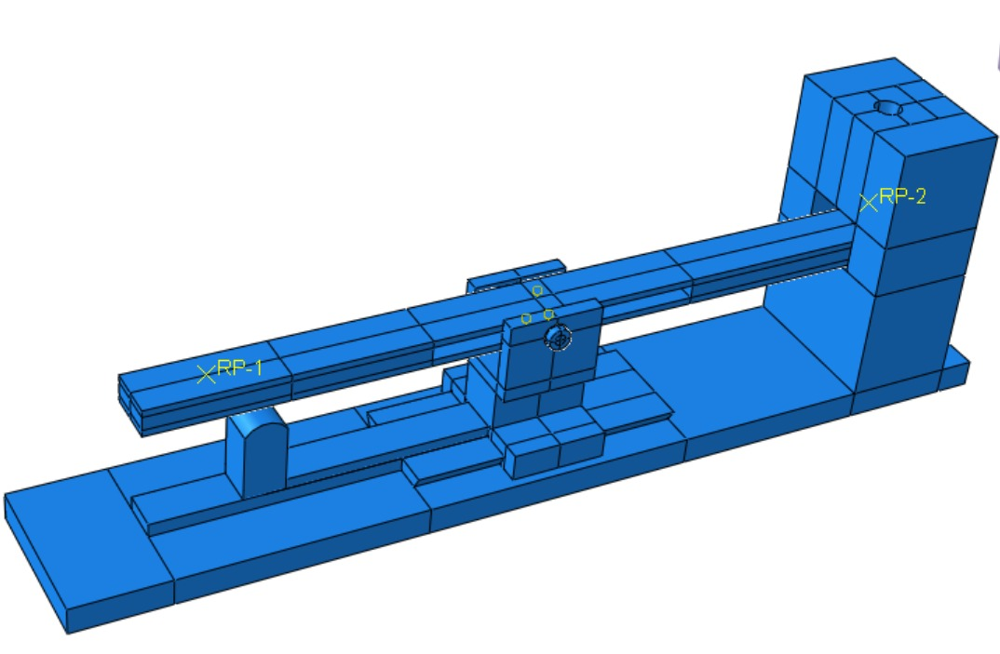
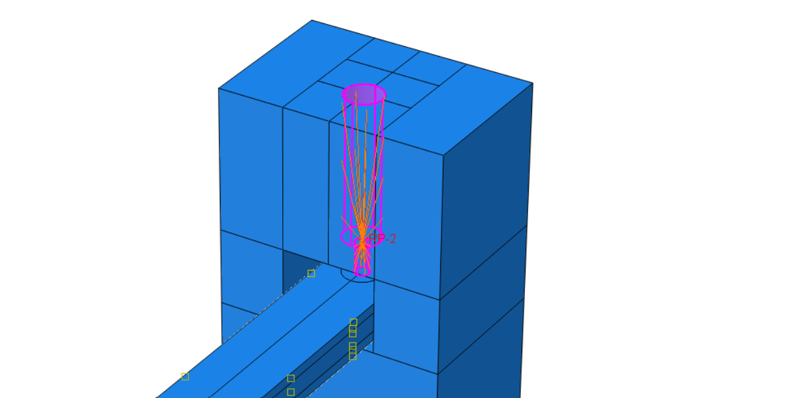
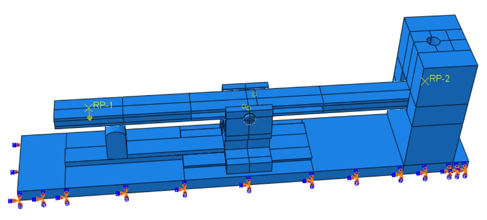
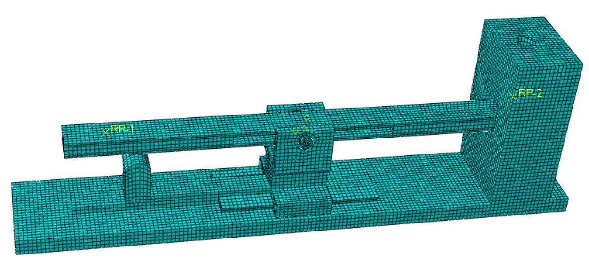
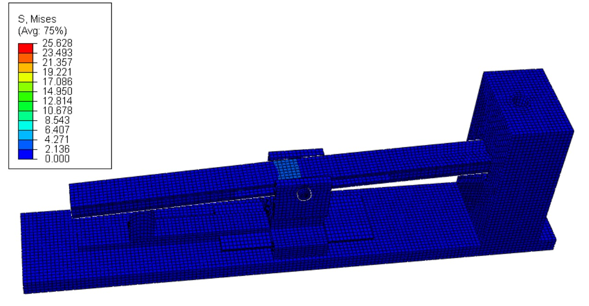
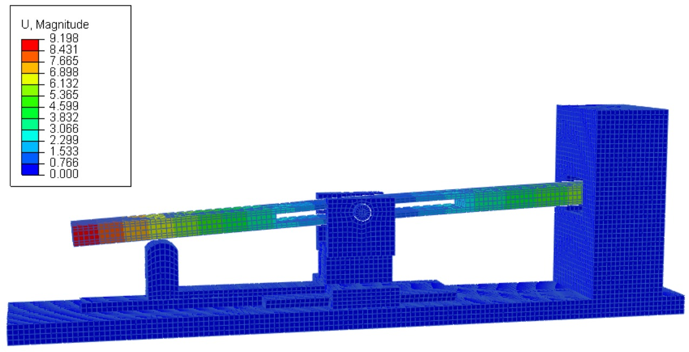

# abaqus-hand-rehabilitation-device
Finite element analysis of a hand rehabilitation device using Abaqus under a representative 4 N load.
# Hand Rehabilitation Device — FEA Study

## Overview
This project is part of my Bachelor's thesis, *Design of a Device for the Rehabilitation of Patients with Hand Conditions*. It focuses on the structural design and numerical evaluation of a 3D-printed mechanical device intended for hand therapy exercises.

The mechanism functions as a first-class lever, where therapeutic input forces are transferred through a central pivot into the main support structure. To evaluate structural integrity and stiffness under normal operating conditions, I developed a finite element model in **Abaqus/CAE** subjected to a functional load of **4 N**.

---

## Key Engineering Highlights
* **Targeted Simplification:** Replaced the helical spring geometry with a Reference Point Kinematic Coupling to represent spring stiffness cleanly without complex contact convergence issues.
* **Structured Hex Mesh:** Partitioned the geometry to build a structured 8-node hexahedral mesh (global size 2.5 mm), optimizing stress resolution along the lever arm.
* **Material & Elastic Limits:** Modeled in isotropic PETG (E = 2200 MPa, Poisson ratio = 0.40). Max stress reached **25.62 MPa**, yielding a Factor of Safety of **1.8–2.1** against PETG yield strength (45–55 MPa).
* **Kinematic Stability:** Maximum displacement (**9.19 mm**) was dominated by operational vertical bending (U3 = -6.56 mm), while lateral play remained negligible (U1 = ±0.006 mm).

---

## Objective
The main goals of this numerical study were:
* Identify critical stress concentration regions under functional loading.
* Evaluate maximum von Mises stress against PETG yield limits.
* Assess lever deflection and overall structural stiffness.
* Validate the kinematic behavior and ensure negligible lateral instability.
* Provide numerical justification for physical 3D-printing prototype fabrication.

---

## My Contribution
Starting from the original CAD assembly created in PTC Creo Parametric, I developed the complete FEA workflow in Abaqus/CAE, including:
* **CAD Simplification:** Removed non-critical fillets, assembly clearances, and adjustment fasteners to prevent artificial stress singularities and element distortion.
* **Spring Idealization:** Modeled the helical spring interaction using Reference Points and Kinematic Couplings.
* **Assembly & Interaction Setup:** Implemented General Contact, Surface-to-Surface definitions with penalty friction, MPC Beam elements, and Tie constraints at the pivot.
* **Meshing & Convergence:** Discretized components with structured hex elements at part level.
* **Post-Processing:** Extracted reaction forces, directional displacements, and stress contours for thesis reporting.

---

## Software and Tools
* **Abaqus/CAE** (FEA setup, solver & post-processing)
* **PTC Creo Parametric** (Original CAD modeling)

---

## Model Setup & Simplification
To improve computational efficiency and numerical convergence without sacrificing structural accuracy:
1. **Geometric Cleansing:** Fillets and small manufacturing gaps were suppressed. Adjustment and pretensioning screws were omitted.
2. **Spring Abstraction:** Instead of modeling complex solid contact on a flexible 3D spring, its mechanical constraint was idealized via a Kinematic Coupling connected to dedicated Reference Points.

---

## Material Properties
The assembly was assigned an isotropic linear elastic material model representing **3D-printed PETG**.

| Property | Value |
| :--- | ---: |
| Material | PETG (Isotropic Elastic) |
| Young's modulus (E) | 2200 MPa |
| Poisson's ratio | 0.40 |
| Yield strength | ~45–55 MPa |

---

## FEA Setup & Boundary Conditions

### Step & Loading
* **Analysis Type:** Static, General
* **Applied Force:** A concentrated load of **4 N** was applied vertically (-Z direction) at the handle Reference Point.

### Boundary Conditions & Constraints
* **Fixed Base:** An **ENCASTRE** condition (U1 = U2 = U3 = UR1 = UR2 = UR3 = 0) was applied to the bottom face of the fixed support.
* **Pivot Interface:** A **Tie constraint** was defined between the pivot shaft and support lugs to prevent unwanted lateral sliding while transmitting bending moments cleanly.
* **Interactions:** Standard General Contact with Surface-to-Surface pairs, Hard normal behavior, Penalty friction (coefficient = 0.2), and MPC Beam constraint.

---

## Mesh
The model was discretized using structured hexahedral elements generated at the part level before final interaction definitions.

| Mesh Parameter | Value |
| :--- | ---: |
| Element Shape | Hexahedral (Hex) |
| Meshing Technique | Structured |
| Global Element Size | 2.5 mm |
| Curvature Control | 0.05 |

---

## Results & Discussion

### Von Mises Stress
The maximum von Mises stress in the assembly reached **25.62 MPa**, located on the upper region of the movable lever near the pivot contact region and force application area.

| Component | Max von Mises Stress | Yield Limit | Factor of Safety (FOS) |
| :--- | ---: | ---: | ---: |
| **Movable Lever** | **25.62 MPa** | **45–55 MPa** | **1.76–2.15** |
| Pivot Shaft | ~4.11 MPa | 45–55 MPa | > 10 |
| Movable Support | ~1.17 MPa | 45–55 MPa | > 35 |
| Fixed Support | ~0.09 MPa | 45–55 MPa | > 500 |

Under the 4 N operational load, all assembly components operate strictly within the elastic regime of PETG.

---

### Displacement & Kinematics
Total peak displacement reached **9.19 mm**. The directional breakdown confirms that deformation occurs along the intended functional axis.

| Displacement Component | Value | Interpretation |
| :--- | ---: | :--- |
| U1 (X - Lateral) | ~±0.006 mm | Negligible side-to-side play |
| U2 (Y - Transverse) | ~0.51 mm | Minor out-of-plane compliance |
| U3 (Z - Vertical) | ~-6.56 mm | Primary lever rotation path |
| **U Magnitude (Total)** | **9.19 mm** | **Peak deflection at handle** |

---

## Conclusions
1. **Structural Margin:** With a peak stress of 25.62 MPa against a 45–55 MPa yield threshold, the PETG design achieves a minimum Factor of Safety of ~1.8 under functional therapeutic loads.
2. **Kinematic Precision:** Directional displacement analysis verifies that over 99% of movement occurs along the intended vertical lever stroke (U3 = -6.56 mm), with virtually zero lateral instability (U1 = 0.006 mm).
3. **Design Readiness:** The simplified numerical model validated the structural rigidity and geometric optimization of the mechanism, successfully supporting physical 3D-printing prototype fabrication.
